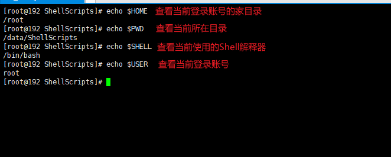

# Shell笔记


## 前言

[什么是Shell？](https://www.jianshu.com/p/488dcf2a7a81)

> Shell是一个命令解释器，它在操作系统的最外层，负责直接与用户进行对话，
>
> 把用户的输入解释给操作系统，并处理各种各样的操作系统的输出结果，输出到屏幕反馈给用户。


Shell的作用

- 解释执行用户输入的命令或程序等
- 用户输入一条命令，shell就解释一条
- 键盘输入命令，Linux给予响应的方式，称之为交互式


shell是一个包裹着系统核心的**壳**，处于操作系统的最外层，与用户直接对话，

把用户的输入`解释`给操作系统，然后处理操作系统的输出结果，输出到屏幕给用户看到结果。


Shell还是一个功能相当强大的编程语言，易编写、易调试、灵活性强。


## Shell解析器

1、Linux提供的Shell解析器有6种：

```shell
[root@192 ~]# cat /etc/shells
```


2、**bash**和**sh**的关系：

```shell
[root@192 bin]# ll | grep bash
```


3、CenterOS默认的解析器是bash：

```shell
[root@192 bin]# echo $SHELL
```


## Shell脚本入门

### 1.脚本格式

脚本以 <span style="color:red;">#!/bin/bash</span> 开头（指定解析器）


### 2.HelloWorld

需求：创建一个Shell脚本，输出 HelloWorld

①创建并编辑脚本

```shell
[root@192 ShellScripts]# touch helloworld.sh
[root@192 ShellScripts]# vim helloworld.sh
```

②脚本内容如下

```sh
#!/bin/bash
echo "Hello World Spring Stone"
```

③执行脚本

```shell
[root@192 ShellScripts]# sh helloworld.sh
```


#### 脚本的常用执行方式

第一种：采用 bash或sh + 脚本的相对路径或绝对路径（不用赋予脚本+x权限）

- sh+脚本的相对路径

```shell
[root@192 ShellScripts]# sh helloworld.sh
```

- sh+脚本的绝对路径

```shell
[root@192 ShellScripts]# sh /data/ShellScripts/helloworld.sh
```

- bash+脚本的相对路径

```shell
[root@192 ShellScripts]# bash helloworld.sh
```

- bash+脚本的绝对路径

```shell
[root@192 ShellScripts]# bash /data/ShellScripts/helloworld.sh
```


第二种：采用输入脚本的绝对路径或相对路径执行脚本（<span style="color:red;">必须具有可执行权限+x</span>）

<span style="color:green;">首先要赋予helloworld.sh脚本的+x权限</span>

```shell
[root@192 ShellScripts]# chmod 777 helloworld.sh
```

执行脚本

- 相对路径

```shell
[root@192 ShellScripts]# ./helloworld.sh
```

- 绝对路径

```shell
[root@192 ShellScripts]# /data/ShellScripts/helloworld.sh
```


<span style="color:red;">**注意：**第一种执行方法，本质是bash解析器帮你执行脚本，所以脚本本身不需要执行权限；第二种执行方法，本质是脚本需要自己执行，所以需要执行权限</span>


### 3.多命令处理

需求：在/data/ShellScripts/目录下创建一个banzhang.txt，在banzhang.txt文件中增加“I love cls”

①创建并编辑脚本

```shell
[root@192 ShellScripts]# touch banzhang.sh
[root@192 ShellScripts]# vim banzhang.sh
```

②脚本内容如下

```sh
#!/bin/bash
cd /data/ShellScripts/
touch banzhang.txt
echo "I love cls" >> banzhang.txt
```

③执行脚本

```shell
[root@192 ShellScripts]# bash banzhang.sh
```


## Shell中的变量

### 1.系统变量

常用系统变量：

`$HOME`、`$PWD`、`$SHELL`、`$USER`等

查看系统变量的值

```shell
[root@192 ShellScripts]# echo $HOME
[root@192 ShellScripts]# echo $PWD
[root@192 ShellScripts]# echo $SHELL
[root@192 ShellScripts]# echo $USER
```



显示当前Shell中所有变量： set

```shell
[root@192 ShellScripts]# set
```

**由于输出内容过多，请勿轻易使用此命令！！！**


### 2.自定义变量

#### 基本语法

> 1、定义变量：变量=值
>
> 2、撤销变量：unset 变量
>
> 3、声明静态变量：readonly 变量名，<span style="color:red;">注意：不能unset</span>


变量定义规则：

1、变量名称可以由字母、数组和下划线组成，但是不能以数字开头，<span style="color:red;">环境变量名建议大写</span>。

2、<span style="color:red;">等号两侧不能有空格</span>。

3、在**bash**中，变量默认类型都是字符串类型，无法直接进行数值运算。

4、变量的值如果有空格，需要使用双引号或单引号括起来。


#### 实操案例

①自定义一个变量并打印它的值，然后给A重新赋值

```shell
[root@192 ShellScripts]# A=1
[root@192 ShellScripts]# echo $A
[root@192 ShellScripts]# A=8
[root@192 ShellScripts]# echo $A
```

==注意：等号两侧不能有空格！！！==


②撤销定义的变量

```shell
[root@192 ShellScripts]# unset A
```


③声明一个静态变量

```shell
[root@192 ShellScripts]# readonly B=2
[root@192 ShellScripts]# echo $B
```

==注意：静态变量不能被 unset 撤销！！！==


④在bash中，变量默认类型都是字符串类型，无法直接进行数值运算

```shell
[root@192 ShellScripts]# C=1+2
[root@192 ShellScripts]# echo $C
```


⑤为变量赋值含有空格的字符串

```shell
[root@192 ShellScripts]# C="xuezhang love mm"
[root@192 ShellScripts]# echo $C
```


⑥可以把变量提升为全局环境变量，可供其他Shell程序使用

<span style="color:red;">语法：export 变量名</span>

```shell
[root@192 ShellScripts]# vim helloworld.sh

# 在helloworld.sh文件中增加echo $B
#!/bin/bash

echo "Hello World Spring Stone"
echo $B

[root@192 ShellScripts]# export B
[root@192 ShellScripts]# ./helloworld.sh
```


### 3.特殊变量：$n

#### 基本语法

功能描述：n为数字，\$0代表该脚本名称；

\$1~$9代表第一到第九个参数；

十及以上的参数需要用大括号包含表示，如\${10}


#### 实操案例

①输出该脚步的文件名称、输入参数1和输入参数2的值

```shell
[root@192 ShellScripts]# touch parameter.sh
[root@192 ShellScripts]# vim parameter.sh

# 脚本内容如下
#!/bin/bash
echo "$0 $1   $2"

[root@192 ShellScripts]# chmod 777 parameter.sh
[root@192 ShellScripts]# bash parameter.sh 1 100
```


### 4.特殊变量：$#

#### 基本语法

功能描述：获取所有输入参数的个数，常用于循环


#### 实操案例

```shell
[root@192 ShellScripts]# vim parameter.sh

# 脚本内容如下
#!/bin/bash
echo "$0 $1  $2"
echo $#

[root@192 ShellScripts]# bash parameter.sh cls xz
```


### 5.特殊变量：\$*、$@

#### 基本语法

\$*：这个变量代表命令行中所有的参数，\$\*把所有的参数看成一个整体

\$@：这个变量也代表命令行中所有的参数，不过\$@把每个参数区分对待


#### 实操案例

```shell
[root@192 ShellScripts]# vim parameter.sh

# 脚本内容如下
#!/bin/bash
echo "$0 $1  $2"
echo $#
echo $*
echo $@

[root@192 ShellScripts]# bash parameter.sh 1 2 3
```


### 6.特殊变量：$?

#### 基础语法

功能描述：最后一次执行的命令的返回状态。如果这个变量的值为0，证明上一次命令正确执行；如果这个变量的值为非0（具体是哪个数字，有命令自己来决定），则证明上一个命令执行不正确了。


#### 实操案例

判断helloworld.sh脚本是否正确执行

```shell
[root@192 ShellScripts]# ./helloworld.sh
[root@192 ShellScripts]# echo $?
```


## 运算符

### 基本语法

（1）“\$((运算式))” 或 “\$[运算式]”

（2）expr 运算符（+，-，*，/，%）

<span style="color:red;">注意：expr和运算符间要有空格</span>


### 实操案例

计算2+3、3-2

```shell
[root@192 ShellScripts]# expr 2 + 3

[root@192 ShellScripts]# expr 3 - 2
```


复杂计算：（2+3）×4

```shell
[root@192 ShellScripts]# expr `expr 2 + 3` \* 4

[root@192 ShellScripts]# s=$[(2+3)*4]
[root@192 ShellScripts]# echo $s
```


## 条件判断

### 基本语法

[ condition ]（<span style="color:red;">注意condition前后要有空格</span>）

==tip：条件非空即为true，[ spring ]返回true，[ ]返回false==


### 常用判断条件

#### 1.两个整数之间比较

`=` 字符串比较

`-lt` 小于 *less than*；	 	  `-le` 小于等于 *less equal*

`-eq` 等于 *equal*；				`-ne` 不等于 *Not equal*

`-gt` 大于 *greater than*；	`-ge` 大于等于 *greater equal*


#### 2.按照文件权限进行判断

`-r` 有读的权限 *read*

`-w` 有写的权限 *write*

`-x` 有执行的权限 *execute*


#### 3.按照文件类型进行判断

`-f` 文件存在并且是一个常规的文件 *file*

`-e` 文件存在 *existence*

`-d` 文件存在并且是一个目录 *directory*


### 实操案例

①判断23是否大于等于22

```shell
[root@192 ShellScripts]# [ 23 -ge 22 ]
[root@192 ShellScripts]# echo $?
```


②判断helloworld.sh是否具有写权限

```shell
[root@192 ShellScripts]# [ -w helloworld.sh ]
[root@192 ShellScripts]# echo $?
```


③判断/data/ShellScripts/cls.txt文件是否存在

```shell
[root@192 ShellScripts]# [ -e /data/ShellScripts/cls.txt ]
[root@192 ShellScripts]# echo $?
```


④多条件判断

&&表示上一条命令执行成功后，才执行下一条命令

||表示上一条命令执行失败后，才执行下一条命令

```shell
[root@192 ShellScripts]# [ condition ] && echo OK || echo 'not OK'
[root@192 ShellScripts]# [ condition ] && [ ] || echo 'not OK'
```


## 流程控制

### 1.if判断

#### 基本语法

```shell
if[ 条件判断式 ];then
	#程序
fi
```

或者

```shell
if[ 条件判断式 ]
	then
		#程序
fi
```

==注意事项：==

（1）[ 条件判断式 ]，中括号和条件判断式之间必须有空格

（2）<span style="color:red;">if后要有空格</span>


#### 实操案例

输入一个数字，如果是**1**，则输出 **banzhang zhen shuai**；如果是**2**，则输出 **cls zhen mei**；如果是其他，则无输出

```shell
[root@192 ShellScripts]# touch if.sh
[root@192 ShellScripts]# vim if.sh

# 脚本内容如下
#!/bin/bash
if [ $1 -eq 1 ];then
	echo 'banzhang zhen shuai'
elif [ $1 -eq 2 ];then
	echo 'cls zhen mei'
fi

[root@192 ShellScripts]# chmod 777 if.sh
[root@192 ShellScripts]# ./if.sh 1
```


### 2.case语句

#### 基本语法

```shell
case $变量名 in

 "val1")
	如果变量的值等于val1，则执行程序1
	;;
 "val2")
 	如果变量的值等于val2，则执行程序2
 	;;
 ...省略其他分支...
 *)
 	如果变量的值都不是以上的值，则执行此程序
 	;;
esac
```

==注意事项：==

（1）case 行尾必须为单词“in”，每一个模式匹配必须以“)”结束

（2）双分号“;;”表示命令序列结束，相当于 java 中的 break

（3）最后的“*)”表示默认模式，相当于 java 中的 default


#### 实操案例

输入一个数字，如果是**1**，则输出 **banzhang**；如果是 **2**，则输出 **cls**；如果是其它，输出 **renyao**

```shell
[root@192 ShellScripts]# touch case.sh
[root@192 ShellScripts]# vim case.sh

# 脚本内容如下
#!/bin/bash
case $1 in
 1)
   echo banzhang
   ;;
 2)
   echo cls
   ;;
 *)
   echo renyao
   ;;
esac

[root@192 ShellScripts]# bash case.sh
```


### 3.for循环

#### 基本语法

```shell
for((初始值;循环控制条件;变量变化))
  do
    程序
  done
```

或

```shell
for 变量 in val1 val2 val3...
  do
    程序
  done
```


#### 实操案例

从1加到100

```shell
[root@192 ShellScripts]# touch for.sh
[root@192 ShellScripts]# vim for.sh

# 脚本内容如下
#!/bin/bash
s=0
for((i=0;i<=100;i++))
  do
    s=$[$s+$i]
  done
echo $s

[root@192 ShellScripts]# bash for.sh
```


打印所有输入的参数，使用**$@**

```shell
[root@192 ShellScripts]# touch for2.sh
[root@192 ShellScripts]# vim for2.sh

# 脚本内容如下
#!/bin/bash
for i in $*
  do
    echo $i
  done

for j in $@
  do
    echo $j
  done

for k in "$*"
  do
    echo $k
  done

for l in "$@"
  do
    echo $l
  done

[root@192 ShellScripts]# bash for2.sh
```


### 4.while循环

#### 基本语法

```shell
while [ 条件判断式 ]
  do
    程序
  done
```


#### 实操案例

从1加到100

```shell
[root@192 ShellScripts]# touch while.sh
[root@192 ShellScripts]# vim while.sh

# 脚本内容如下
#!/bin/bash
s=0
i=1
while [ $i -le 100 ]
  do
    s=$[$s+$i]
    i=$[$i+1]
  done
echo $s

[root@192 ShellScripts]# bash while.sh
```


## read读取控制台输入

### 基本语法

```shell
read(选项)(参数)
```

选项：

- -p：指定读取值时的提示符；
- -t：指定读取值时等待的时间（秒）

参数：

- 变量：指定读取值的变量名


### 实操案例

提示7秒，读取控制台输入的名称

```shell
[root@192 ShellScripts]# touch read.sh
[root@192 ShellScripts]# vim read.sh

# 脚本内容如下
#!/bin/bash
read -t 7 -p "Enter your name in 7 seconds" NAME
echo $NAME

[root@192 ShellScripts]# bash read.sh
```


## 函数

### 1.系统函数

#### basename

**基本语法**

```shell
basename [string / pathname] [suffix]
```


**功能描述**

basename 命令会删掉所有的前缀包括最后一个 `/` 字符，然后将字符串显示出来


**选项**

suffix 为后缀，如果 suffix 被指定了，basename 会将 pathname 或 string 中的suffix 去掉


**实操案例**

截取该 /home/spring/springstone.txt 路径的文件名称

```shell
[root@192 ShellScripts]# basename /home/spring/springstone.txt
# springstone.txt
[root@192 ShellScripts]# basename /home/spring/springstone.txt .txt
# springstone
```


#### dirname

**基本语法**

```shell
dirname 文件绝对路径
```


**功能描述**

从给定的绝对路径中去除文件名，然后返回剩下的路径


**实操案例**

获取 springstone.txt 文件的路径

```shell
[root@192 ShellScripts]# dirname /home/spring/springstone.txt
# /home/spring
```


### 2.自定义函数

#### 基本语法

```shell
[ function ] funname[()]
{

	Action;
	[return int;]

}

funname
```

==中括号中的内容可以省略==


#### 经验技巧

1.必须在调用函数地方之前，先声明函数，shell脚本是逐行运行的。不会像其他语言一样预编译。

2.函数返回值，只能通过`$?`系统变量获得，可以显示加 **return** 返回；如果不加，将以最后一条命令运行结果作为返回值。

**return** 后跟数值 n(0~255)


#### 实操案例

计算两个输入参数的和

```shell
[root@192 ShellScripts]# touch sum.sh
[root@192 ShellScripts]# vim sum.sh

# 脚本内容如下
#!/bin/bash
function sum()
{
	s=0;
	s=$[$1+$2];
	echo $s;
}

read -p "input your parameter1:" P1
read -p "input your parameter2:" P2

sum $P1 $P2

[root@192 ShellScripts]# bash sum.sh
```


## Shell工具

### 1.cut

**cut** 的工作就是“剪”，具体的说就是在文件中负责剪切数据用的。

**cut** 命令从文件的每一行剪切字节、字符和字段并将它们输出。

#### 基本用法

```shell
cut [选项参数] filename
```

==说明：默认分隔符是制表符==


#### 选项参数

| 参数   | 功能                         |
| ------ | ---------------------------- |
| **-f** | 列号，提取第几列             |
| **-d** | 分隔符，按照指定分隔符分割列 |


#### 实操案例

```shell
# 数据准备
[root@192 ShellScripts]# touch cut.txt
[root@192 ShellScripts]# vim cut.txt

# 文本内容如下
dong shen
guan zhen
wo  wo
lai  lai
le  le

# 切割 cut.txt 第一列字符
[root@192 ShellScripts]# cut -d " " -f 1 cut.txt
dong
guan
wo
lai
le

# 切割 cut.txt 第二、三列
[root@192 ShellScripts]# cut -d " " -f 2,3 cut.txt
shen
zhen
 wo
 lai
 le

# 在 cut.txt 文件中切割出 guan
[root@192 ShellScripts]# cat cut.txt | grep "guan" | cut -d " " -f 1
guan

# 选取系统PATH变量值，第2个“:”开始后的所有路径
[root@192 ShellScripts]# echo $PATH
/usr/local/sbin:/usr/local/bin:/usr/sbin:/usr/bin:/data/service/jdk/bin:/data/service/maven/bin:/root/bin
[root@192 ShellScripts]# echo $PATH | cut -d : -f 2-
/usr/local/bin:/usr/sbin:/usr/bin:/data/service/jdk/bin:/data/service/maven/bin:/root/bin

# 切割ifconfig后打印的IP地址
[root@192 ShellScripts]# ifconfig ens33 | grep "inet " | cut -d "" -f 10
192.168.230.128
```


### 2.sed

**sed** 是一种<span style="color:red;">流</span>编辑器，它一次处理一行内容。

处理时，把当前处理的行存储在临时缓冲区中，称为“模式空间”，接着用 **sed** 命令处理缓冲区中的内容，处理完成后，把缓冲区的内容送往屏幕。

接着处理下一行，这样不断重复，直到文件末尾。

<span style="color:red;">文件内容并没有改变</span>，除非你使用重定向存储输出。

#### 基本语法

```shell
sed [选项参数] 'command' filename
```


#### 选项参数

| 参数   | 功能                                                     |
| ------ | -------------------------------------------------------- |
| **-e** | 直接在指令列模式（即有多个command）上进行 sed 的动作编辑 |


#### 命令功能

| 命令  | 功能                                      |
| ----- | ----------------------------------------- |
| **a** | 新增（a的后面可以接字符串，在下一行出现） |
| **d** | 删除                                      |
| **s** | 查找并替换                                |


#### 实操案例

```shell
# 数据准备
[root@192 ShellScripts]# touch sed.txt
[root@192 ShellScripts]# vim sed.txt

# 文本内容如下
dong shen
guan zhen
wo  wo
lai  lai

le  le

# 1.将“mei nv”这个单词插入到 sed.txt 第二行下，打印
[root@192 ShellScripts]# sed '2a mei nv' sex.txt
dong shen
guan zhen
mei nv
wo  wo
lai  lai

le  le

# 文本原内容未发生改变
[root@192 ShellScripts]# cat sed.txt
dong shen
guan zhen
wo  wo
lai  lai

le  le

# 2.删除 sed.txt 文件中所有包含 wo 的行
[root@192 ShellScripts]# sed '/wo/d' sed.txt
dong shen
guan zhen
lai  lai

le  le

# 3.将 sed.txt 文件中 wo 替换成 ni
# 注意：g表示global，全局替换
[root@192 ShellScripts]# sed 's/wo/ni/g' sed.txt
dong shen
guan zhen
ni  ni
lai  lai

le  le

# 4.将 sed.txt 文件中第二行删除，并将 wo 替换为 ni
[root@192 ShellScripts]# sed -e '2d' -e 's/wo/ni/g' sed.txt
dong shen
ni  ni
lai  lai

le  le
```


### 3.awk

一个强大的文本分析工具，把文件逐行的读入，以空格为默认分隔符将每行切片，切开的部分再进行分析处理。

#### 基本语法

```shell
awk [选项参数] 'pattern1{action1} pattern2{action2} ...' filename
```

==pattern：表示 AWK 在数据中查找的内容，即匹配模式==

==action：在找到匹配内容时所执行的一系列命令==


#### 选项参数

| 参数   | 功能                   |
| ------ | ---------------------- |
| **-F** | 指定输入文件拆分分隔符 |
| **-v** | 赋值一个用户定义变量   |


#### 实操案例

```shell
# 数据准备
[root@192 ShellScripts]# sudo cp /etc/passwd ./

# 搜索 passwd 文件中 以 root 关键字开头的所有行，并输出该行的第7列
[root@192 ShellScripts]# awk -F : '/^root/{print $7}' passwd
/bin/bash

# 搜索 passwd 文件中 以 root 关键字开头的所有行，并输出该行的第1列和第7列，中间以逗号分隔
[root@192 ShellScripts]# awk -F : '/^root/{print $1","$7"}' passwd
root,/bin/bash

# 注意：只有匹配了 pattern 的行，才会执行 action

# 只显示 /etc/passwd 的第1列和第7列，以逗号分隔，
# 且在第一行添加列名 user，shell
# 在最后一行添加“dahaige,/bin/zuishuai"
[root@192 ShellScripts]# awk -F : 'BEGIN{print "user,shell"} {print $1","$7} END{print "dahaige,/bin/zuishuai"}' passwd
user,shell
root,/bin/bash
bin,/sbin/nologin
...
dahaige,/bin/zuishuai

# 注意：BEGIN 在所有数据读取行之前执行；END 在所有数据执行之后执行

# 将 passwd 文件中的用户 id 增加 数值1并输出
[root@192 ShellScripts]# awk -v i=1 -F : '{print $3+i}' passwd
1
2
3
4
...
```


#### awk的内置变量

| 变量     | 说明                                   |
| -------- | -------------------------------------- |
| FILENAME | 文件名                                 |
| NR       | 已读的记录数                           |
| NF       | 浏览记录的域的个数（切割后，列的个数） |


#### 实操案例

```shell
# 统计 passwd 文件名，每行的行号，每行的列数
[root@192 ShellScripts]# awk -F '{ print "filename:" FILENAME ", linenumber:" NR ", columns:" NF}' passwd
filename:passwd, linenumber:1, columns:7
filename:passwd, linenumber:2, columns:7
filename:passwd, linenumber:3, columns:7

# 切割IP
[root@192 ShellScripts]# ifconfig ens33 | grep "inet " | awk -F " " '{print $2}'
192.168.230.128

# 查询 sed.txt 中空行所在的行号（使用正则）
[root@192 ShellScripts]# awk '/^$/{print NR}' sed.txt
5
7
```


### 4.sort

sort 命令在Linux中非常有用，它将文件进行排序，并将排序结果标准输出。

#### 基本语法

```shell
sort (选项) (参数)
```

==参数：指定待排序的文件列表==


#### 选项参数

| 选项 | 说明                     |
| ---- | ------------------------ |
| -n   | 依照数值的大小来排序     |
| -r   | 以相反的顺序来排序       |
| -t   | 设置排序时所用的分隔字符 |
| -k   | 指定需要排序的列         |


#### 实操案例

```shell
# 数据准备
[root@192 ShellScripts]# touch sort.sh
[root@192 ShellScripts]# vim sort.sh

# 脚本内容如下
bb:40:5.4
bd:20:4.2
xz:50:2.3
cls:10:3.5
ss:30:1.6

# 按照“:”分割后把第三列倒序排序
[root@192 ShellScripts]# sort -t : -nrk 3 sort.sh
xz:50:2.3
bb:40:5.4
ss:30:1.6
bd:20:4.2
cls:10:3.5
```


## 企业真实面试题

### 1.京东


### 2.搜狐&和讯网


### 3.新浪

问题1：用Shell写一个脚本，对文本中无序的一列数字排序

```shell
cat test.txt
9
8
7
6
5
4
3
2
10
1

sort -n test.txt | awk '{a+=$0; print $0} END{print "SUM="a}'
1
2
3
4
5
6
7
8
9
10
SUM=55
```


### 4.金和网络


